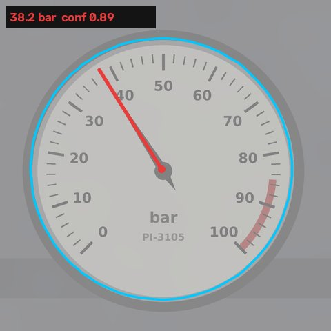

# Roger Walkdown Insights

**Turning a teleoperated humanoid's inspection walkdown into decisions a plant team can act on.**

> Independent concept demo built by Sapnil. All data, frames and the platform ("Demo Platform Alpha") are simulated. Not affiliated with or endorsed by Minerva Humanoids.

**Live demo:** https://sapnilpatel.github.io/roger-walkdown-insights/



## The problem

A humanoid like Roger can walk a platform's inspection route so a person doesn't have to enter the hazardous areas. But a refinery or offshore operator isn't paying for the walk. They pay for what comes out of it:

- every gauge on the route read and logged
- anything abnormal flagged *during* the walkdown, while the robot is still there
- slow problems caught across walkdowns, not just today's snapshot
- work orders with photo evidence, in the format their maintenance system expects

If the teleoperator has to read and transcribe every gauge, the robot has replaced the walk but not the work. This project is the layer that does that work automatically, and knows when to hand a frame back to the human.

## What it does

```
head-camera frame ──► read gauge ──► confident? ──no──► operator confirms from live view
                                       │ yes
                                       ▼
                          check limits + walkdown history
                                       ▼
                    action list / work orders / plant report
```

1. **Reads analog gauges** from the robot's camera frame (classical computer vision, ~50 ms per frame on a laptop CPU, no training data). Off-axis views are corrected by fitting the dial's ellipse and warping it back to a circle.
2. **Scores its own confidence** from how clearly the needle stands out and how sharp it is. Below the threshold, the reading is not trusted and goes back to the operator.
3. **Classifies each stop** against normal and alarm limits from the asset register: `OK`, `WATCH`, `ALARM` or `REVIEW`.
4. **Looks across walkdowns** for slow drift (projected to hit an alarm limit within a few rounds) and sudden step changes.
5. **Produces the outputs** a plant team uses: a prioritised action list, a CSV of work orders with photo evidence, and the dashboard.

## The simulated walkdown

12 stops on a fictional offshore platform, 11 of them in hazardous areas (hydrocarbon release zones, H2S wellbay, high-pressure compression). The run surfaces three things:

| Stop | What happened | Why it matters |
|---|---|---|
| PI-3105 crude export pump discharge | Read **38 bar** through heavy smoke. Normal is 60–80, and it was ~72 on the last five walkdowns | **P1 alarm + sudden change.** Caught even through haze |
| PI-2350 compressor discharge | 128 bar, just above normal. But it's been climbing ~3 bar every walkdown | **Drift.** Hits the alarm limit in ~2 walkdowns. One walkdown with a clipboard wouldn't see this |
| PI-5310 fuel gas supply | Glare washed out the dial. The raw read was 60 bar (top of scale) | **Would have been a false alarm.** Confidence was 0.02, so it went to the operator instead |

## Can the reads be trusted?

`python -m walkdown.evaluate` renders frames with random true values under seven camera conditions, each with random severity from mild to extreme. The confidence threshold is chosen on one set of 1,050 frames (lowest threshold where *every* condition reaches 99% accuracy on accepted reads) and the numbers below are from a **separate held-out set** of 1,050 frames the threshold never saw.

Tolerance: 2% of full scale, about the accuracy class of an industrial process gauge itself.

| Condition | Reads within tolerance | Accepted automatically | Accepted reads correct | Bad reads caught |
|---|---:|---:|---:|---:|
| Clear view | 100.0% | 100.0% | 100.0% | n/a |
| Glare on glass | 90.7% | 88.7% | 100.0% | 100% |
| Low light | 100.0% | 100.0% | 100.0% | n/a |
| Motion blur | 96.0% | 91.3% | **98.5%** | 67% |
| Smoke / haze | 100.0% | 100.0% | 100.0% | n/a |
| Off-axis view | 100.0% | 100.0% | 100.0% | n/a |
| Fogged glass | 100.0% | 100.0% | 100.0% | n/a |
| **All** | **98.1%** | **97.1%** | **99.8%** | **90%** |

Motion blur misses the 99% target on held-out data. That's reported, not tuned away. In the field the fix is operational: when confidence is low, Roger holds still and re-shoots.

## What this does not prove yet

- **Real footage.** Frames are rendered so every read has an exact answer key. The next step is validating on real head-camera frames from a pilot site.
- **Gauge variety.** One dial style is modelled. Real platforms mix dial faces, digital displays, sight glasses and valve positions.
- **Finding the gauge.** Each frame here is already centred on its gauge. In the field a detector picks the gauge out of the wider view and matches it to its asset tag (e.g. by position on the route or a tag plate).
- **Synthetic difficulty is a guess.** The early version scored 100% everywhere, which said more about the simulator than the reader. Severity was then randomised up to extreme so the benchmark could fail. Real conditions will still be different.

## Run it

```bash
pip install -r requirements.txt

python -m walkdown.run            # simulate the walkdown, write docs/ (dashboard + data)
python -m walkdown.run --eval     # also re-run the full evaluation (~2 minutes)
python -m pytest -q               # tests

uvicorn walkdown.api:app --reload # HTTP service
curl -F image=@docs/frames/PI-2350.jpg -F tag=PI-2350 localhost:8000/read
```

Open `docs/index.html` in a browser, or see the live demo.

## Repo layout

```
walkdown/
  route.py      asset register: gauge calibration, limits, history (simulated)
  synth.py      renders camera frames with known ground truth + degradations
  reader.py     gauge reading, off-axis correction, confidence
  analyze.py    limits, drift and step-change detection, work orders
  evaluate.py   accuracy on held-out frames per camera condition
  run.py        runs the walkdown and builds the dashboard
  api.py        FastAPI service: POST a frame + asset tag, get a reading
docs/           GitHub Pages site (dashboard, frames, JSON + CSV outputs)
tests/          fast checks run in CI
```

## Outputs

- `docs/data/walkdown.json`: every reading, status, trend and recommendation
- `docs/data/work_orders.csv`: ready to import into a maintenance system (SAP PM, Maximo and similar take CSV imports)
- `docs/data/evaluation.json`: the accuracy numbers above
