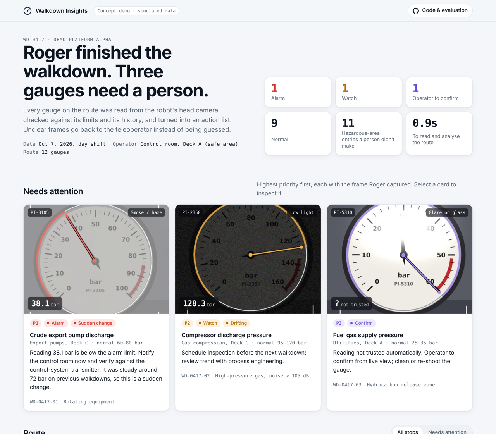
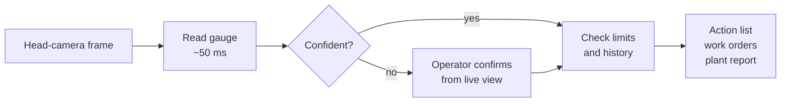
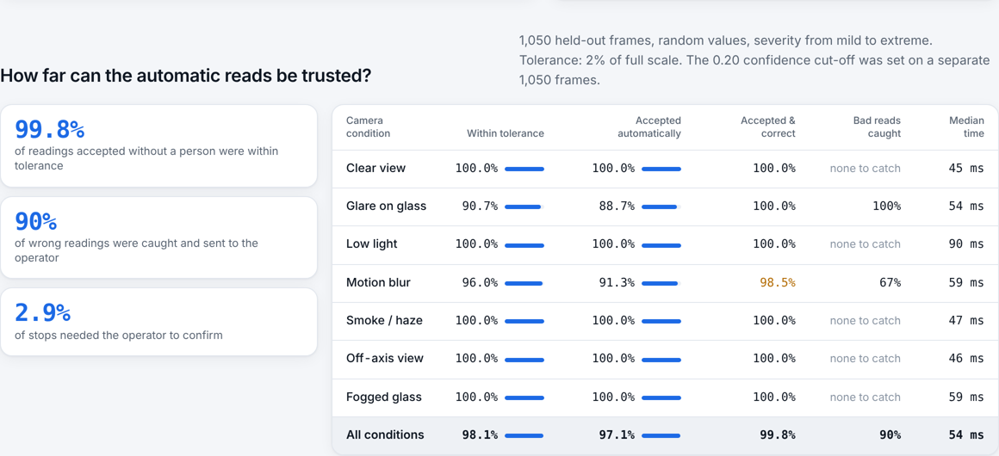

<div align="center">

# Roger Walkdown Insights

**Turning a teleoperated humanoid's inspection walkdown into decisions a plant team can act on.**

[](https://sapnilpatel.github.io/roger-walkdown-insights/)

[](https://github.com/SapnilPatel/roger-walkdown-insights/actions/workflows/ci.yml)


**[sapnilpatel.github.io/roger-walkdown-insights](https://sapnilpatel.github.io/roger-walkdown-insights/)**

</div>

<a href="https://sapnilpatel.github.io/roger-walkdown-insights/">
<picture>
  <source media="(prefers-color-scheme: dark)" srcset="docs/assets/dashboard-dark.png">
  
</picture>
</a>

> [!NOTE]
> Independent concept demo built by Sapnil. The platform ("Demo Platform Alpha"), camera frames and readings are all simulated. Not affiliated with or endorsed by Minerva Humanoids.

---

## The problem

A humanoid like Roger can walk a platform's inspection route so a person doesn't have to enter the hazardous areas. But an operator isn't paying for the walk. They pay for what comes out of it:

- every gauge on the route **read and logged**
- anything abnormal **flagged during the walkdown**, while the robot is still there
- slow problems **caught across walkdowns**, not just in today's snapshot
- **work orders with photo evidence**, in the format their maintenance system expects

If the teleoperator still has to read and transcribe every gauge, the robot has replaced the walk but not the work. This project is the layer that does that work, and knows when to hand a frame back to the human.

## How it works



| Step | What happens |
|---|---|
| **Read** | Classical computer vision finds the dial, corrects off-axis views by fitting its ellipse and warping it back to a circle, then finds the needle as the darkest ray across the sweep. No training data needed. |
| **Trust** | Confidence comes from how clearly the needle stands out and how sharp it is. Below the threshold, the reading is not trusted and goes to the operator. |
| **Classify** | Each stop is checked against normal and alarm limits from the asset register: `OK`, `WATCH`, `ALARM` or `REVIEW`. |
| **Trend** | Readings from earlier walkdowns reveal slow drift (projected to hit an alarm limit within a few rounds) and sudden step changes. |
| **Report** | A prioritised action list, a CSV of work orders with photo evidence, and the dashboard. |

## What the demo walkdown surfaces

12 stops on a fictional offshore platform, 11 of them in hazardous areas (hydrocarbon release zones, an H2S wellbay, high-pressure compression).

| | Stop | What happened | Why it matters |
|:-:|---|---|---|
| 🔴 | **PI-3105** crude export pump discharge | Read **38 bar** through heavy smoke. Normal is 60–80, and it was ~72 on the last five walkdowns | **P1 alarm and sudden change**, caught even through haze |
| 🟠 | **PI-2350** compressor discharge | 128 bar, just above normal, but climbing ~3 bar every walkdown | **Drift.** Reaches the alarm limit in ~2 walkdowns. One walkdown with a clipboard wouldn't see it |
| 🟣 | **PI-5310** fuel gas supply | Glare washed out the dial. The raw read was 60 bar, the top of the scale | **A false alarm that never happened.** Confidence was 0.02, so it went to the operator instead |

## Can the reads be trusted?

<picture>
  <source media="(prefers-color-scheme: dark)" srcset="docs/assets/reliability-dark.png">
  
</picture>

`python -m walkdown.evaluate` renders frames with random true values under seven camera conditions, each with random severity from mild to extreme.

- The **confidence threshold** is chosen on a calibration set of 1,050 frames: the lowest threshold at which *every* condition reaches 99% accuracy on accepted reads.
- The numbers are reported on a **separate held-out set** of 1,050 frames the threshold never saw.
- **Tolerance** is 2% of full scale, about the accuracy class of an industrial process gauge itself.

| Condition | Within tolerance | Accepted automatically | Accepted & correct | Bad reads caught |
|---|---:|---:|---:|---:|
| Clear view | 100.0% | 100.0% | 100.0% | n/a |
| Glare on glass | 90.7% | 88.7% | 100.0% | 100% |
| Low light | 100.0% | 100.0% | 100.0% | n/a |
| Motion blur | 96.0% | 91.3% | **98.5%** | 67% |
| Smoke / haze | 100.0% | 100.0% | 100.0% | n/a |
| Off-axis view | 100.0% | 100.0% | 100.0% | n/a |
| Fogged glass | 100.0% | 100.0% | 100.0% | n/a |
| **All** | **98.1%** | **97.1%** | **99.8%** | **90%** |

Motion blur misses the 99% target on held-out data. That's reported here rather than tuned away. In the field the fix is operational: when confidence is low, Roger holds still and re-shoots.

## What this does not prove yet

- **Real footage.** Frames are rendered so every read has an exact answer key. The next step is validating on real head-camera frames from a pilot site.
- **Gauge variety.** One dial style is modelled. Real platforms mix dial faces, digital displays, sight glasses and valve positions.
- **Finding the gauge.** Each frame here is already centred on its gauge. In the field, a detector picks the gauge out of the wider view and matches it to its asset tag.
- **Synthetic difficulty is a guess.** An early version scored 100% everywhere, which said more about the simulator than the reader. Severity was then randomised up to extreme so the benchmark could fail. Real conditions will still differ.

## Run it locally

```bash
pip install -r requirements.txt

python -m walkdown.run            # simulate the walkdown and build docs/ (dashboard + data)
python -m walkdown.run --eval     # also re-run the full evaluation (~2 minutes)
python -m pytest -q               # tests
```

Then open `docs/index.html` in a browser.

### API

```bash
uvicorn walkdown.api:app --reload
curl -F image=@docs/frames/PI-2350.jpg -F tag=PI-2350 localhost:8000/read
```

```json
{
  "tag": "PI-2350",
  "reading": { "value": 128.25, "confidence": 0.947, "method": "hough", "...": "..." },
  "unit": "bar",
  "status": "WATCH",
  "operator_confirmation_required": false
}
```

## Repo layout

```
walkdown/
├── route.py      asset register: gauge calibration, limits, history (simulated)
├── synth.py      renders camera frames with known ground truth + degradations
├── reader.py     gauge reading, off-axis correction, confidence
├── analyze.py    limits, drift and step-change detection, work orders
├── evaluate.py   accuracy on held-out frames per camera condition
├── run.py        runs the walkdown and builds the dashboard
└── api.py        FastAPI service: POST a frame + asset tag, get a reading
docs/             GitHub Pages site (dashboard, frames, JSON + CSV outputs)
tests/            fast checks run in CI
```

## Outputs

| File | Contents |
|---|---|
| [`docs/data/walkdown.json`](docs/data/walkdown.json) | Every reading, status, trend and recommendation |
| [`docs/data/work_orders.csv`](docs/data/work_orders.csv) | Ready to import into a maintenance system (SAP PM, Maximo and similar accept CSV) |
| [`docs/data/evaluation.json`](docs/data/evaluation.json) | The accuracy numbers above |

---

<div align="center">
<sub>Built by <a href="https://github.com/SapnilPatel">Sapnil</a> as a concept for Roger's pilot walkdowns.</sub>
</div>
